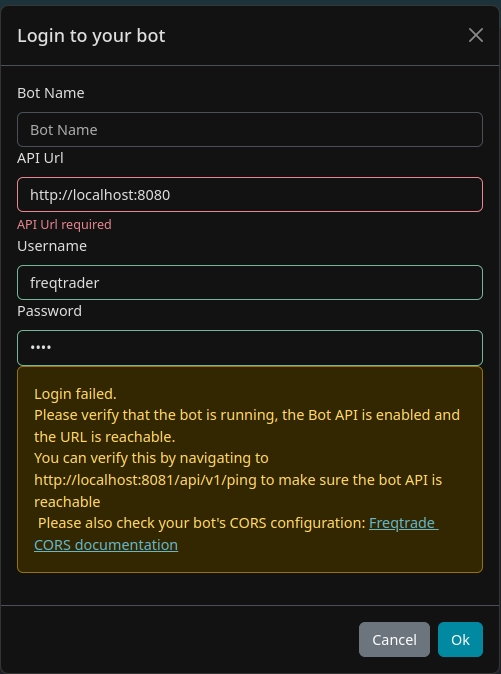
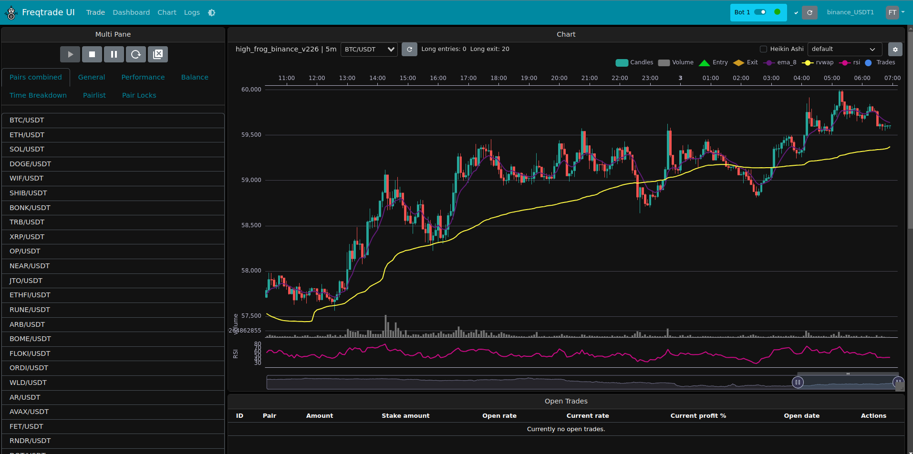

# FreqUI

Freqtrade provides a builtin webserver, which can serve [FreqUI](https://github.com/freqtrade/frequi), the freqtrade frontend.

By default, the UI is automatically installed as part of the installation (script, docker).
freqUI can also be manually installed by using the `freqtrade install-ui` command.
This same command can also be used to update freqUI to new new releases.

Once the bot is started in trade / dry-run mode (with `freqtrade trade`) - the UI will be available under the configured API port (by default `http://127.0.0.1:8080`).

??? Note "Looking to contribute to freqUI?"
    Developers should not use this method, but instead clone the corresponding use the method described in the [freqUI repository](https://github.com/freqtrade/frequi) to get the source-code of freqUI. A working installation of node will be required to build the frontend.

!!! tip "freqUI is not required to run freqtrade"
    freqUI is an optional component of freqtrade, and is not required to run the bot.
    It is a frontend that can be used to monitor the bot and to interact with it - but freqtrade itself will work perfectly fine without it.

## Configuration

FreqUI does not have it's own configuration file - but assumes a working setup for the [rest-api](rest-api.md) is available.
Please refer to the corresponding documentation page to get setup with freqUI

## UI

### Login

The below screenshot shows the login screen of freqUI.

!!! Hint "CORS"
    The Cors error shown in this screenshot is due to the fact that the UI is running on a different port than the API, and [CORS](#cors) has not been setup correctly yet.

### Trade view

The trade view allows you to visualize the trades that the bot is making and to interact with the bot.
On this page, you can also interact with the bot by starting and stopping it and - if configured - force trade entries and exits.

### Plot Configurator

FreqUI Plots can be configured either via a `plot_config` configuration object in the strategy (which can be loaded via "from strategy" button) or via the UI.
Multiple plot configurations can be created and switched at will - allowing for flexible, different views into your charts.

The plot configuration can be accessed via the "Plot Configurator" (Cog icon) button in the top right corner of the trade view.

### Settings

Several UI related settings can be changed by accessing the settings page.

Things you can change (among others):

* Timezone of the UI
* Visualization of open trades as part of the favicon (browser tab)
* Candle colors (up/down -> red/green)
* Enable / disable in-app notification types

--8<-- "includes/cors.md"
